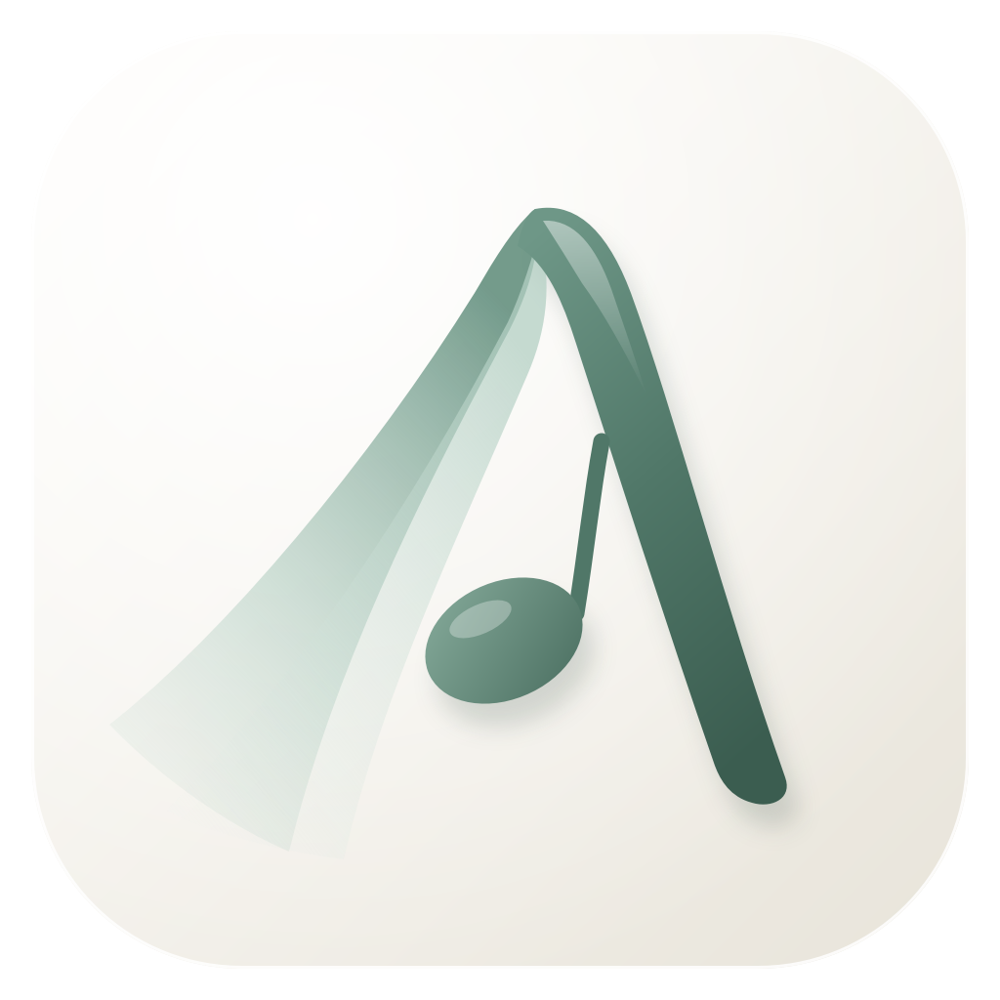

Aria MusicPlayer
======


> 2023 &copy; alanwu-9852

專案簡介
---
（介面語言：English）

播放、收藏與下載串流音樂的桌面播放器，支援 YouTube、Bilibili、Spotify、SoundCloud，並會自動推薦「相關」的歌曲接著播。

支援平台
---

| 平台 | 搜尋 | 貼連結 | 播放方式 |
|---|---|---|---|
| YouTube | ✓ | 影片、Shorts、播放清單 | 直接串流 |
| Bilibili | ✓ | 影片、分 P、b23.tv 短網址 | 直接串流 |
| Spotify | – | 歌曲、專輯、播放清單 | 讀取歌曲資訊後，自動對應到 YouTube 播放（Spotify 音訊有 DRM） |
| SoundCloud | ✓ | 歌曲、歌單 | 直接串流 |
| 其他網站 | – | yt-dlp 支援的連結 | 直接串流 |
| 本機檔案 | – | 「收藏 › 加入檔案…」 | 直接播放 |

自動推薦
---
播放列右側的 ✦ 開啟時，佇列播完會自動接上推薦的歌；「播放中 › 推薦」可以隨時查看與挑選。

- 推薦一律來自 YouTube。正在播的若是 Bilibili、Spotify 等其他平台，會先找出對應的 YouTube 影片當作推薦依據。
- 推薦的是**相關**而不是**相同**：同一首歌的翻唱、Live、Remix、歌詞版、重新上傳、簡繁不同的標題，都視為「同一首」並排除；已播過或已在佇列中的歌也不會再出現。
- **原作優先**：歌詞版、動態歌詞、加速／降速、Nightcore、Remix、二創剪輯、伴奏、AI 翻唱等衍生影片不會被推薦；其他歌的翻唱、Live 可以推薦，但排在官方原版之後。
- 以目前這首為主，再綜合整個佇列（前、中、後段各取一首）與最近播過的歌，並避免同一位歌手連續出現；編輯佇列後推薦會跟著更新。若推薦來源幾乎都是同一位歌手，會從你常一起聽的其他歌手延伸出去。
- 依你的習慣微調順序：你常和這些歌手一起聽的歌手、收藏裡的歌手、同時出現在多個推薦來源的歌手會稍微往前排；合輯與串燒影片會被排除。
- **探索程度（Discovery）**：「For You」上方的滑桿，往左（♡）偏向收藏過、常聽的歌手，往右（羅盤）偏向沒聽過的歌手；調整時直接重新排序，不必重新抓取。

使用說明
---
執行環境：Windows 10 / 11，Python 3.10 以上（專案已附 VLC 3.0.18）。

```bash
pip install -r requirements.txt
python main.py
```

YouTube 經常改版。若出現「無法播放」，在「主控台」輸入 `update` 更新 yt-dlp 後重新啟動即可。若電腦裝有 [Deno](https://deno.com) 或 Node.js，yt-dlp 會用它解 YouTube 的簽章，相容性更好。

### 介面

- **播放中**：封面、佇列（可拖曳排序）、推薦、播放紀錄、歌詞；背景會依封面微微上色（Smart Artwork，低飽和度）
- **聆聽階段（Sessions）**：「History › Sessions」把每段連續聆聽整理成卡片，例如「October 9 · Evening Session — 18 tracks」，記錄開始時間、實際聆聽時長、播放順序與期間收藏的歌；點開可重播或存成播放清單。停止聆聽 30 分鐘後該段結束
- **時長適配播放**：佇列上方的計時器按鈕，選 25／45／60 分鐘或自訂（例如 31:25），從收藏或目前佇列挑出總長最接近、又不超過的歌，最後一首會自然結束；從佇列挑時若時間不夠，會用自動推薦補滿；佇列上方與狀態列會倒數剩餘時間
- **搜尋**：輸入關鍵字，或直接貼上任何支援的連結；歌單連結可一次加入佇列或收藏
- **收藏**：收藏的歌、下載（可離線播放）、開啟下載資料夾、匯入／匯出歌單（相容 v1 的 JSON）
- **List／Disc Rack**：收藏與播放清單的工具列右側可切換成 CD 架——每首歌是一張直立的單曲 CD，書脊顏色取自封面（低飽和）；滑過或用方向鍵選到時，CD 盒會稍微抽出、露出部分封面，後面的盒子自動讓位，不遮住任何一張。單擊選取並在下方顯示資訊，雙擊播放，右鍵與清單相同；兩種視圖共用篩選與選取，會記住最後使用的視圖
- **唱片架（Shelf）**：右上角 Cover／Spine 切換正面陳列或側面書脊；Spine 模式滑過時專輯盒會抽出約一半、露出封面，點一下打開。把喜歡的專輯與播放清單照自己的順序排在架上（Cover 模式可拖曳排序）；點開以唱片內頁呈現曲目與資訊。可用名稱搜尋、貼上 Spotify 專輯／播放清單、YouTube 播放清單、Bilibili 多 P 連結，或放上自己的播放清單（會即時同步內容，封面為歌曲拼貼）
- **專輯完整播放**：在唱片架打開專輯按 Play（或雙擊任一首），會照原始曲序播放、曲目之間無縫銜接、期間不插入自動推薦；專輯播完後一切恢復原狀（原本的佇列接在後面）
- **播放清單**：側邊欄 Playlists 旁的 ＋ 建立；任何歌曲右鍵 › Add to Playlist，正在播放的歌可用播放列的清單按鈕或 Ctrl+P 加入
- **智慧收藏（Smart Collections）**：同一個 ＋ 選「New Smart Collection」，用條件自動組成清單並隨收藏與播放紀錄更新，例如「最近 30 天收藏」「收藏但還沒完整聽過」「已下載的日文歌」；條件可組合（全部符合／任一符合），可只看收藏或連同聽過的歌
- **快速命令（Ctrl+K）**：浮動的命令框，可搜尋歌曲（先找自己的音樂，再找 YouTube）與執行功能，例如 Add to Playlist、Download Current Track、Switch Source、Open Shelf、Listen for 25 Minutes；↑↓ 選擇、Enter 執行／播放、Shift+Enter 加入佇列
- **移除時可一併刪檔**：從收藏或播放清單移除已下載的歌時，可勾選「Also delete downloaded files」；正在播放的那個檔案會等這首歌結束後再刪除
- **主控台**：即時紀錄與指令列，輸入 `help` 查看所有指令
- **設定**：自然過渡、柔和恢復、自動推薦、下載後改播本機、音量平衡、外觀、Smart Artwork、減少動態效果、關閉時縮到系統匣

### 歌詞

歌詞來自 [LRCLIB](https://lrclib.net)，有時間軸的歌詞會跟著歌曲捲動，點一行可跳到該處。在設定開啟「強化歌詞抓取」後，歌詞庫找不到時會從影片說明欄與留言中找出像歌詞的段落（留言裡附時間的歌詞也能同步）。在歌詞上按右鍵可複製該行或從該行播放。

### 播放

- **自然過渡**：歌曲結尾與下一首交疊淡入淡出（3／6／9／12 秒）；單曲重複時也會無縫接回開頭，按「上一首」重播也不會有斷點
- **柔和恢復**：暫停超過一分半後繼續，音量從小慢慢回來
- **來源切換**：播放中的歌下載完成時會無縫改從本機檔案播放；也可以在「播放中」用「串流／本機」手動切換
- **系統匣與迷你播放器**：關閉視窗後繼續在背景播放；迷你播放器永遠置頂、可拖曳，也能調整音量（與主視窗同步）
- **音量平衡（Volume Balance，Windows）**：按音量滑桿右邊的天平按鈕，滑桿就變成 Aria 與其他程式的相對音量——往右突出 Aria（調低其他程式），往左讓其他程式更清楚（調低 Aria），中間維持原狀；只會調低另一方，不會突然變大聲。依分貝調整（最多 -24 dB），所有輸出裝置上的程式都會套用，拖曳時會顯示兩邊目前的音量比例。其他程式的原始音量會在回到中間或關閉 Aria 時還原（即使 Aria 異常結束，下次啟動也會還原）。「設定 › Audio」可排除特定程式（Discord、Teams、Zoom 等通話軟體預設排除），或改成只管理選定的程式

所有按鈕的說明都在滑鼠停留的提示裡；在清單上按右鍵有完整動作選單。

### 快捷鍵

| 按鍵 | 作用 |
|---|---|
| 空白鍵 | 播放／暫停 |
| Ctrl + ← / → | 上一首／下一首 |
| Ctrl + ↑ / ↓ | 音量 ± 5 |
| Ctrl + M | 靜音 |
| Ctrl + D | 收藏目前的歌 |
| Ctrl + F | 搜尋 |
| Ctrl + O | 加入本機音樂檔 |
| Ctrl + K | 快速命令 |
| Ctrl + 1 – 6 | 切換頁面 |
| Ctrl + N | 新增播放清單 |
| Ctrl + P | 把正在播放的歌加入播放清單 |
| Ctrl + Shift + M | 迷你播放器 |
| Ctrl + , | 設定 |
| Ctrl + Q | 結束（不留在系統匣） |
| Enter / Delete | 播放／移除選取的歌 |

### 資料

收藏、佇列、播放清單（含智慧收藏）、唱片架、聆聽階段與播放統計、設定、下載的音檔與快取都放在 `data/`。第一次啟動時會自動匯入 v1 的 `assets/saved.json` 與 `assets/queue.json`。

專案結構
---

```
aria/
  core/        資料模型、播放（VLC）、佇列與推薦、收藏與下載、儲存
  providers/   各平台的搜尋、連結解析、串流與下載
  ui/          PySide6 介面：主題 token、元件、頁面
tests/         標題比對、推薦過濾與排序、時長適配、智慧收藏、聆聽階段、歌單匯入的測試（pytest）
```

介面依循〈介面設計規範〉：色彩只透過 token 取用、跟隨系統深淺色、同列控制項等高 30、圓角不超過短邊 1/3、畫面上不放操作說明。

本專案強調色：淺色 `#507768`、深色 `#93bead`（HSL 157° / 20%，依規範 §1.3 一次抽定）。

版本更新
---
* v1.0.0-beta (2023/11/12): 測試版
* v1.0.1-beta (2024/01/18): Bug Fixed
    1. 修復了重新載入後須重啟才可更新音樂名稱
* v2.6.0 (2026/10/10)
    1. 收藏與播放清單新增 Disc Rack 視圖；唱片架新增 Cover／Spine 切換（CD 盒抽出效果、鍵盤操作、減少動態效果設定）
    2. 修正唱片架滑過時反白區塊與架板、文字重疊
    3. 音量平衡改用分貝曲線、套用到所有輸出裝置，拖曳時顯示目前比例
    4. 移除歌詞註記
    5. 時長適配從佇列挑歌不足時，以自動推薦補滿
    6. 刪除正在播放的本機檔案時，改為等歌曲結束後自動刪除
* v2.5.0 (2026/10/09)
    1. 新增聆聽階段（History › Sessions）、時長適配播放、探索程度滑桿、專輯完整播放（無縫銜接）、快速命令（Ctrl+K）、智慧收藏、音量平衡
    2. 自動推薦原作優先：排除歌詞版、加速、二創等衍生影片；翻唱可推薦但排在原版之後；推薦來源只有單一歌手時會延伸到相關歌手
    3. 迷你播放器加入音量滑桿；唱片架深色模式的滑過效果更明顯
    4. 未播放時從歷史紀錄「加入佇列」不會再直接開始播放另一首；未預期的錯誤會寫入紀錄檔
    5. 關閉自然過渡時，歌曲之間也會預先緩衝、無縫接續
* v2.4.0 (2026/10/09)
    1. 移除星圖
    2. 自動推薦加入個人化排序（常一起聽的歌手、收藏、多來源共同推薦），並排除合輯
* v2.3.0 (2026/10/09)
    1. 介面改為英文
    2. 移除收藏／播放清單時可一併刪除已下載的檔案
    3. 唱片架可放播放清單（線上清單與自己的清單）
    4. 正在播放的歌可直接加入播放清單（Ctrl+P）
    5. 星圖改用逐格彈簧動畫、快取繪製與停留預載，切換更流暢
    6. 側邊欄收合時外觀按鈕移到收合按鈕上方，收合按鈕位置固定
    7. 效能：頁面延後建立、yt-dlp 延後載入、字型與封面繪製快取
* v2.2.0 (2026/10/09)
    1. 新增歌詞（LRCLIB 同步歌詞；可選強化抓取：說明欄、留言）
    2. 自動推薦改為綜合目前播放與整個佇列
    3. 修正啟動後音量沒有沿用上次設定（兩個播放軌共用系統音量所致）
    4. 啟動時先顯示載入畫面；側邊欄 logo 對齊與清晰度；減少並縮小提示框
* v2.1.0 (2026/10/09)
    1. 新增唱片架、星圖、多個播放清單
    2. 新增自然過渡（含無縫單曲重複）、柔和恢復、Smart Artwork
    3. 新增系統匣與迷你播放器；可開啟下載資料夾，播放中可在串流與本機檔案間無縫切換
    4. 操作更即時：載入中按暫停會直接取消、選到的歌先在背景解析、縮短緩衝；YouTube 串流改用可快速跳轉的格式
    5. 新的 App 圖示
* v2.0.0 (2026/10/09): 全面重構
    1. 改用 PySide6 重新設計介面，支援深色模式
    2. 新增 Bilibili、Spotify、SoundCloud 與本機檔案
    3. 新增自動推薦（相關而非相同）
    4. 串流網址在播放時才取得並快取，不再需要「重新加載」；下一首會預先載入
    5. 播放紀錄、上一首、重複播放、拖曳排序、篩選收藏
    6. 主控台新增指令列

致謝
---
- 介面圖示形狀取自 [Lucide](https://lucide.dev)（ISC License）；App 圖示原始檔在 `assets/icon.svg`（小尺寸用 `assets/icon-small.svg`）
- 簡繁對照表取自 [OpenCC](https://github.com/BYVoid/OpenCC)（Apache License 2.0）
- 播放核心為 [VLC](https://www.videolan.org)，解析使用 [yt-dlp](https://github.com/yt-dlp/yt-dlp)

如果你有任何建議或問題，請隨時聯繫作者
